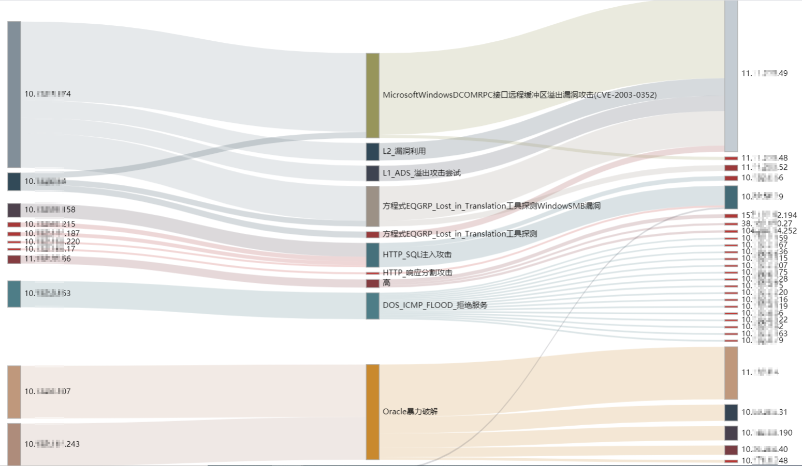

# SOC_Sankey_Generator

## 简介
这是一款从SOC日志中进行数据ETL与数据可视化的工具，可以快速将日志呈现为Sankey图，适合安全日报、周报、月报中使用；也适合HW行动中防守方每日汇报。

## 环境&依赖
python3  
pandas(必选，用于处理csv)  
pyinstaller(可选，exe打包用)  

## 用法
将日志文件整理成表头为：**源地址,目的地址,事件名称,事件数** 的CSV格式文件，放于csv目录下
运行mian.py或者main.exe按提示输入完成数据处理，最后浏览器访问http://127.0.0.1:8900即可。

## 展示

## 过滤器用法
本工具支持包含与排除两种正则过滤器，请在conf目录下的filter.csv文件中进行配置。  
配置说明为：  
第一列：过滤模式[in=包含,ex=排除]  
第二列：字段列号[0=源地址,1=目的地址,2=攻击方式]  
第三列：匹配值[正则匹配]  
第四列：备注

例如：
ex,0,114.114.114.114,备注  
为：排除源地址是114.114.1114.114的事件  
  
in,2,暴力破解,备注  
为：仅查看事件名称中包含暴力破解的事件
